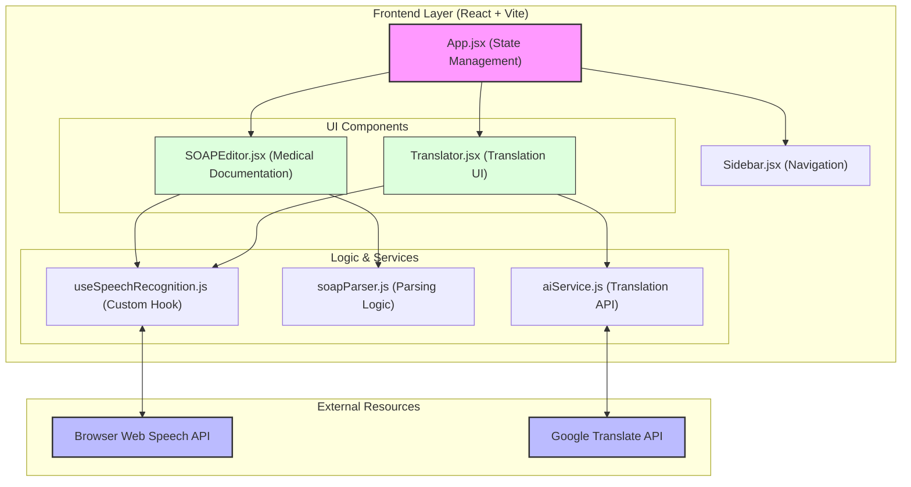

# Solution Architecture: Doctor EMR Voice

Doctor EMR Voice adalah aplikasi berbasis Web yang membantu tenaga medis melakukan dokumentasi medis menggunakan suara (Voice-to-Text) dan menyediakan fitur penerjemah medis instan.

## Architecture Overview

Aplikasi ini dibangun menggunakan arsitektur **Client-Side Heavy** memanfaatkan API browser modern untuk pengenalan suara dan API eksternal untuk pemrosesan teks.

## Component Details

### 1. UI Layer
- **App.jsx**: Mengelola state global seperti navigasi antar fitur (EMR vs Translator).
- **SOAPEditor.jsx**: Interface utama untuk penulisan catatan medis. Mengintegrasikan input suara dan hasil parsing.
- **Translator.jsx**: Interface untuk menerjemahkan teks medis ke berbagai bahasa.

### 2. Logic & Hooks Layer
- **useSpeechRecognition.js**: Mengenkapsulasi kompleksitas `window.SpeechRecognition`. Mengelola state `transcript`, `isListening`, dan error handling.
- **soapParser.js**: Berisi logika cerdas untuk membagi transkrip suara menjadi bagian **Subjective, Objective, Assessment,** dan **Plan**.

### 3. Service Layer
- **aiService.js**: Berfungsi sebagai jembatan komunikasi ke API eksternal. Saat ini menggunakan Google Translate Unofficial API untuk performa cepat tanpa biaya tambahan.

### 4. Browser & Cloud Integration
- **Web Speech API**: Digunakan untuk pemrosesan suara secara lokal di browser user (privasi lebih terjaga dan tanpa biaya API).
- **Google Translate API**: Digunakan untuk fitur penerjemah medis lintas bahasa.

## Data Flow (Voice-to-EMR)
1. User menekan tombol mikrofon di **SOAPEditor**.
2. **useSpeechRecognition** memicu **Web Speech API**.
3. Browser mengirimkan transkrip teks secara real-time.
4. Teks transkrip diproses oleh **soapParser**.
5. Hasil parsing (S.O.A.P) ditampilkan kembali di UI **SOAPEditor** untuk diedit oleh dokter.
